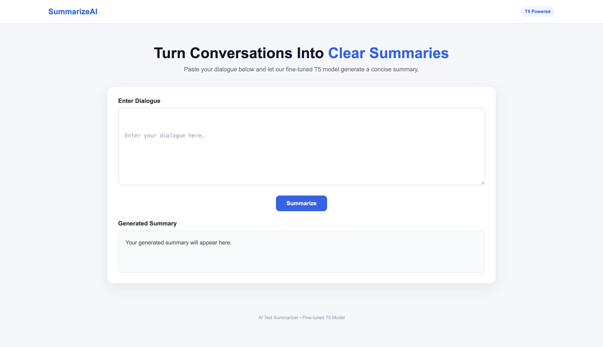
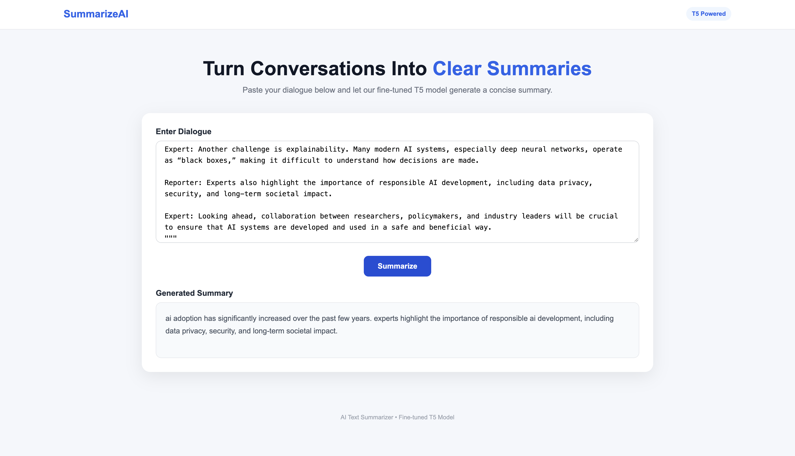

# 📝 T5 Text Summarizer

An **abstractive text summarization web application** built using a fine-tuned **T5 Transformer**, **PyTorch**, and **FastAPI**.

The application takes conversational text as input and generates a concise summary while preserving the important information.

## ✨ Features

- Abstractive text summarization using T5
- Fine-tuned on the SAMSum dialogue dataset
- FastAPI backend with REST API
- Beam Search for better summary generation
- Simple HTML/CSS web interface
- Automatic CPU, CUDA, and Apple MPS support
- Trained model hosted on Hugging Face

## 🛠 Tech Stack

`Python` `PyTorch` `Transformers` `T5` `FastAPI` `Jinja2` `HTML` `CSS`

## 🧠 Model

The project uses a fine-tuned **T5-small** model.

**Training**
- Epochs: 6
- Batch Size: 8
- Warmup Steps: 500

**Inference**
- Maximum Input Length: 512 tokens
- Maximum Summary Length: 150 tokens
- Beam Search: 4 beams

The trained model is hosted on Hugging Face:

**Vansh-02/t5-text-summarizer**

## 🔄 Workflow

```text
Input Dialogue
      ↓
Text Preprocessing
      ↓
T5 Tokenizer
      ↓
Fine-Tuned T5 Model
      ↓
Beam Search
      ↓
Generated Summary
```

## 📸 Screenshots

### Home Page



### Generated Summary



## 📂 Project Structure

```text
├── app.py
├── text_summarizer.ipynb
├── requirements.txt
├── template/
├── static/
└── screenshots/
```

## 🚀 Run Locally

Clone the repository:

```bash
git clone <repository-url>
cd <repository-name>
```

Install dependencies:

```bash
pip install -r requirements.txt
```

Start the FastAPI server:

```bash
uvicorn app:app --reload
```

Open:

```text
http://127.0.0.1:8000
```

## 🔌 API

### POST `/summarize/`

Request:

```json
{
  "dialogue": "Your dialogue text..."
}
```

Response:

```json
{
  "summary": "Generated summary..."
}
```

FastAPI documentation is available at `/docs`.

## 👨‍💻 Author

**Vansh Vishwakarma**

B.Tech Computer Science Engineering  
Machine Learning • Deep Learning • NLP